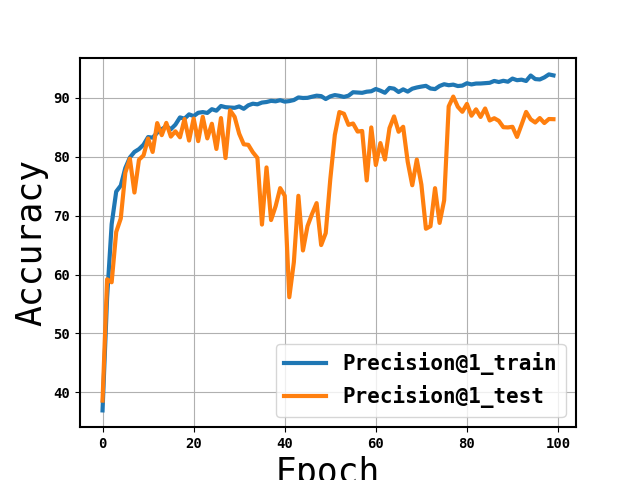
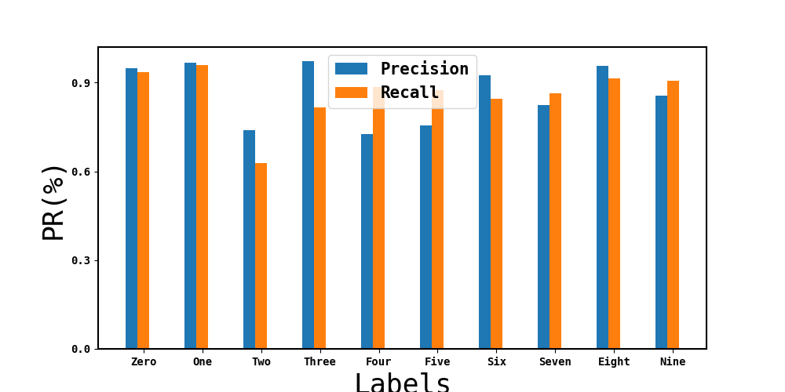
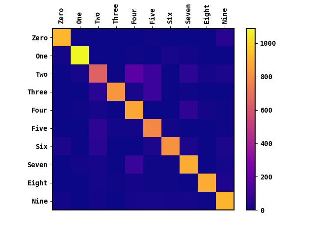
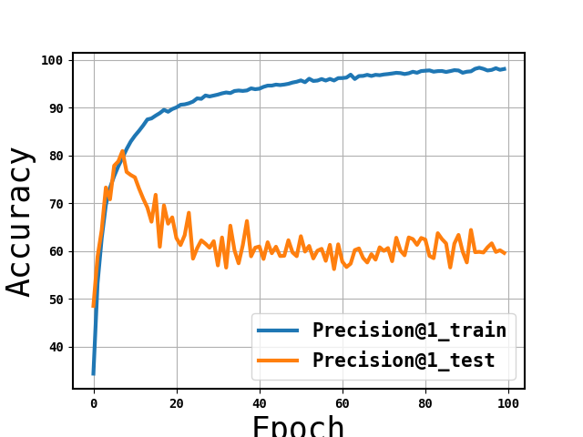
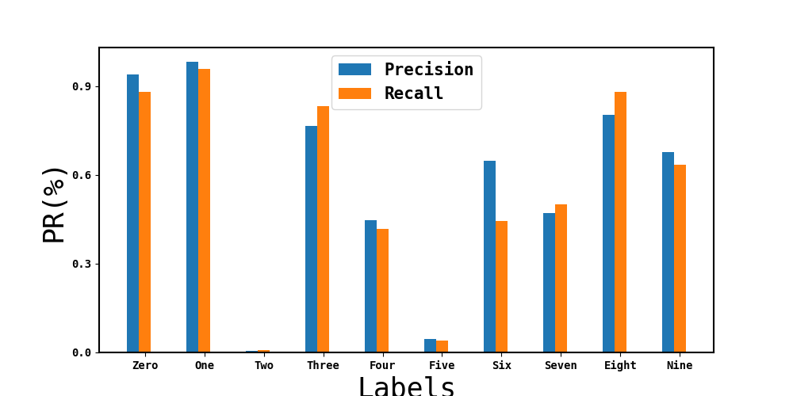
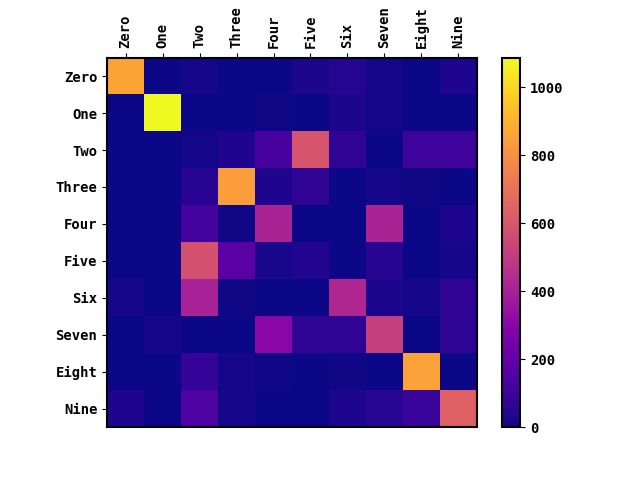
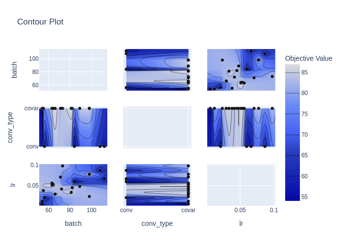
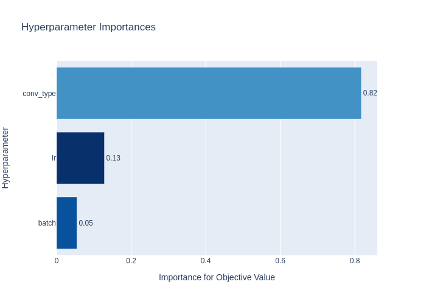
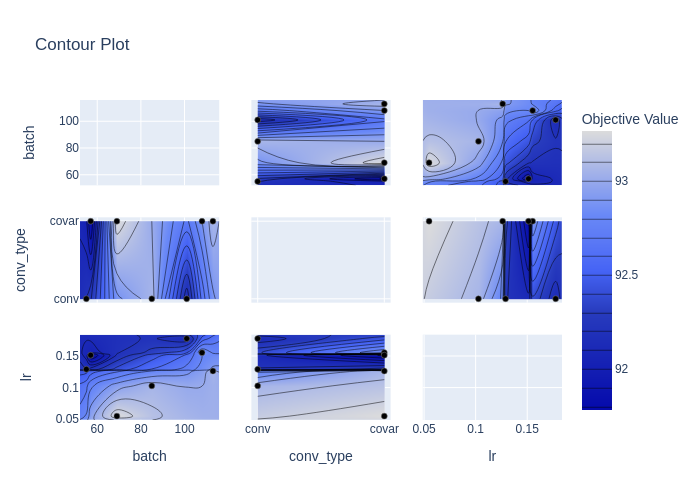
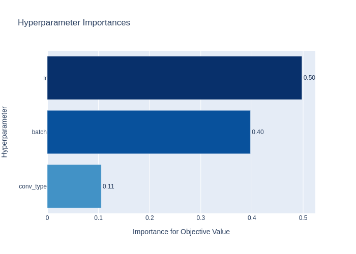

## Approximately_covariant_cnn
This README.md is generated on Jan-23-2021. 
First update made on Oct-04-2021.

### General Description
The code implements the main idea discussed in 
* Girum Demisse and Matt Feiszli. ***Approximately Covariant Convolutional Networks***. hal-03132459 arXiv, 2021.
* You can download the document from https://hal.archives-ouvertes.fr/hal-03132459.
  
### Code of Conduct
***If you use this software (Approximately_Covariant_CNN) in its entirety or partially, please consider citing the reference listed above.***

### Dataset
Inorder to conduct a direct test, you need to donwload a test dataset and dump it under "/data" folder; Rot-MNIST can be downloaded from [here](https://sites.google.com/a/lisa.iro.umontreal.ca/public_static_twiki/variations-on-the-mnist-digits). I also recommend playing with the training apparoch and compositional transfromations using the [affNIST](http://www.cs.toronto.edu/~tijmen/affNIST/) dataset, which is designed to evaluate a model's robustness to affine transformations.

### Requirments
* The software is developed and tested using python3 with Pytorch 1.7.1 and Cuda 10.2.
You will need to have the latest versions of matplotlib, numpy, and pickle5, optuna, plotly. 
* I highly recommend to use GPU's with RAM > 8GB. The current implementation of the AC unit is
  both memory and compute intesnive.

### How To:
General approach
* Use the run.sh script to run a batch of exeprimental scenarios.
* To run specific unit tests, run the run_test.py script from the top-level module. 
* An example script that shows how to optimal hyperparameter are estimated is included as hyperOptim.py.

Examples
* Training a RESNET8 model on ROTMNIST training set and testing it on MNIST dataset while using "AC-convolutions" under the effcicent inference mode.
<pre><code>python3 main.py -lr 0.05 -opt adam -bs 100 -ep 100 -d 8 -ct covar -ss 0 -im 1 -ty 1 -n 1 -ds rotmnist</code></pre>

&nbsp;&nbsp;&nbsp;
&nbsp;&nbsp;&nbsp;

* Conducting the same experiment as above using conventional "convolution".
<pre><code>python3 main.py -lr 0.05 -opt adam -bs 100 -ep 100 -d 8 -ct conv -ss 0 -im 1 -ty 1 -n 1 -ds rotmnist</code></pre>

&nbsp;&nbsp;&nbsp;
&nbsp;&nbsp;&nbsp;

* Optimal hyperparameter search for best performing RESNET8 model on the up above experimental scenario. The Hyperparameters are
  * Convolution type (conv_type): [AC-conv / conv]
  * Learning Rate (lr)
  * Batch size (bath)
<pre><code>python3 hyperOptim.py</code></pre>
* Using the "./optimal_hyper/visualize_HyperPar.ipynb" notebook you can visualize results as shown below.

&nbsp;&nbsp;&nbsp;&nbsp;

*  Optimal hyperparameter search for best performing RESNET10 using CIFAR10 dataset; The possible symmetry set is discretized scaling and reflection (without efficient inference).

&nbsp;&nbsp;&nbsp;&nbsp;

### What is Next?
* A generalized formulation of the approch is under development along with efficient implemention of the AC module.
* To ease experimentation and scalability, the current code base is being refactored to include some simple but important design patterns.

### Author
Girum G Demisse: <girumdemisse@gmail.com>. Comments and reports of error are welcome!
